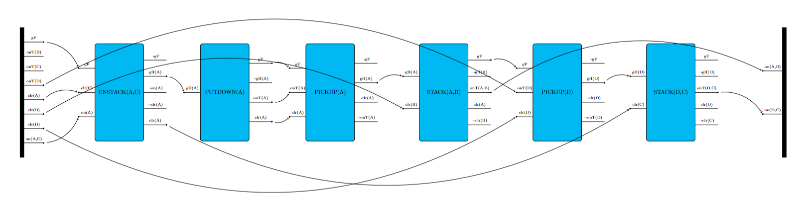

# **Instructions for Generating TikZ Diagrams Using LaTeX**
You could find the example code on: https://github.com/YikaiGe/tikz-aiplans/tree/main/Example/BlocksWorld
## **1. Set Up the LaTeX Project**

1. **Create a Folder Structure**:
   - Set up a directory with the following structure:
     - `project_root/`
       - `tikzlibraryaiplans.code.tex` (library code)
       - `domain.tex` (for defining TikZ styles)
       - `main.tex` (the main document that compiles everything)
       - `yourplan.tex`, such as `plan-blocksworld.tex` (in Example) 

2. **Main LaTeX Document (`main.tex`)**:
   - Create a `main.tex` file that includes the `domain.tex` and the specific plan file (`yourplan.tex`, such as `blocksworld.tex` in Example.

     ```latex
     \documentclass[border=1in]{standalone}
     \usepackage{tikz}
     \usetikzlibrary{aiplans}
     \begin{document}
     \input{domain}  % Load the TikZ style definitions
     \input{yourplan}  % Load the specific plan
     \end{document}
     ```

     Replace `yourplan` with the actual plan file name you are using.


## **2. Define Custom TikZ Styles (`domain.tex`)**

In this step, you will create a `domain.tex` file where you define custom TikZ styles that represent different actions or states in your diagrams. These styles determine the appearance and behavior of the elements in your diagram, such as shapes, colors, and connections.

Before defining the styles, it is important to understand the structure of the style commands. Each TikZ style you define follows a specific pattern:

<div style="page-break-after: always;"></div>

```latex
NameOfScheme /. style n args = {num of input parameters}
    {action= 
      % number of precs/effs
      {num of precondition lines (on the left side of action)}
      {num of effect lines (on the right side of action)}
      % prec/eff labels
      {sequence of precondition labels}
      {sequence of effect labels}
      % length of precs/effs
      {length of preconditions}
      {length of effects}
      % action name
      {action name}
      % prec/eff label position
      {precondition/effect label position: side or top}
      {height of node}
    }

INIT/.style={
  init={
    % number of effs
    {number of effects},
    {effects},
    {effects length},
    {height of init}
    }
    }

GOAL/.style={
  goal={
    {number of preconditons},
    {preconditons},
    {preconditons length},
    {height of goal}
    }
    }
```


---

### **Example: Custom Styles for a Blocksworld Plan (`blocksworld.tex_domain.tex`)**

In the first example, the styles correspond to actions like `PICKUP`, `PUTDOWN`, `STACK`, and `UNSTACK` in a blocks world scenario:

```latex
% Define action
\tikzset{
    INIT/.style={init={8}{gF,onT(B),onT(C),onT(D),clr(A),clr(B),clr(D),{on(A,C)}}{1.2}{8 cm}}, 
    PICKUP/.style n args ={1}{STYLE={3}{4}{gF,onT(#1),clr(#1)}{$\neg$gF,gH(#1),$\neg$clr(#1),$\neg$onT(#1)}{PICKUP(#1)}},
    PUTDOWN/.style n args ={1}{STYLE={1}{4}{gH(#1)}{gF,$\neg$gH(#1),onT(#1),clr(#1)}{PUTDOWN(#1)}},
    STACK/.style n args ={2}{STYLE={2}{5}{gH(#1),clr(#2)}{gF,$\neg$gH(#1),onT{(#1,#2)},clr(#1),$\neg$clr(#2)}{STACK{(#1,#2)}}},
    UNSTACK/.style n args ={2}{STYLE={3}{5}{gF,clr(#2),on(#1)}{$\neg$gF,gH{(#1)},$\neg$on(#1),$\neg$clr(#1),clr(#1)}{UNSTACK{(#1,#2)}}},
    GOAL/.style={goal={2}{{on(A,B)},{on(D,C)}}{1.2}{8 cm}}
}
```

- **INIT**: Initializes the starting state of the world.
- **PICKUP**: Represents the action of picking up an object.
- **PUTDOWN**: Represents the action of putting down an object.
- **STACK**: Represents stacking one object on top of another.
- **UNSTACK**: Represents unstacking one object from another.
- **GOAL**: Defines the goal state that the plan should achieve.

## **3. Create the Specific Plan File**


In this step, you will create the plan file that will generate the desired diagram. This file contains the actual TikZ commands needed to structure and visualize the plan or process you're depicting.

The plan file is where you define the positions and connections of different actions or states. You will place nodes (representing actions or states) and connect them using paths (arrows) to illustrate the flow or sequence in your diagram.

---

#### **Example(`blocksworld.tex`, corresponding to Picture 1):**

In this example, we create a sequential plan for manipulating blocks, where each node represents an action like `UNSTACK`, `PICKUP`, `PUTDOWN`, or `STACK`, and connections between nodes represent causal links.

```latex
\begin{tikzpicture}

    \node[INIT] (init) at (0,0){};
    \node[UNSTACK={A}{C}] (unstackAC) at (6,0) {};
    \node[PUTDOWN={A}] (putdownA) at (12.5,0) {};
    \node[PICKUP={A}] (pickupA) at (19,0) {};
    \node[STACK={A}{B}] (stackAB) at (26,0) {};
    \node[PICKUP={D}] (pickupD) at (33,0) {};
    \node[STACK={D}{C}] (stackDC) at (40,0) {};
    \node[GOAL] (goal) at (47,0){};


    \draw [->, shorten <= 0.2cm, shorten >= 0.1cm]  (init-eff-1) node [circle,fill,inner sep=0.1em]{} to [bend left]  (unstackAC-pre-1) node [circle,fill,inner sep=0.1em]{};
    \draw [->, shorten <= 0.2cm, shorten >= 0.1cm] (init-eff-5) node [circle,fill,inner sep=0.1em]{} to [bend left] (unstackAC-pre-2) node [circle,fill,inner sep=0.1em]{};
    \draw [->, shorten <= 0.2cm, shorten >= 0.1cm] (init-eff-8) node [circle,fill,inner sep=0.1em]{} to[bend right] (unstackAC-pre-3) node [circle,fill,inner sep=0.1em]{};
    \draw [->, shorten <= 0.2cm, shorten >= 0.1cm] (unstackAC-eff-2) node [circle,fill,inner sep=0.1em]{} to[bend left] (putdownA-pre-1) node [circle,fill,inner sep=0.1em]{};
    \draw [->, shorten <= 0.2cm, shorten >= 0.1cm] (putdownA-eff-1) node [circle,fill,inner sep=0.1em]{} to[bend left] (pickupA-pre-1) node [circle,fill,inner sep=0.1em]{};
    \draw [->, shorten <= 0.2cm, shorten >= 0.1cm] (putdownA-eff-3) node [circle,fill,inner sep=0.1em]{} to[bend right] (pickupA-pre-2) node [circle,fill,inner sep=0.1em]{};
    \draw [->, shorten <= 0.2cm, shorten >= 0.1cm] (putdownA-eff-4) node [circle,fill,inner sep=0.1em]{} to[bend right] (pickupA-pre-3) node [circle,fill,inner sep=0.1em]{};
    \draw [->, shorten <= 0.2cm, shorten >= 0.1cm] (pickupA-eff-2) node [circle,fill,inner sep=0.1em]{} to[bend left] (stackAB-pre-1) node [circle,fill,inner sep=0.1em]{};
    \draw [->, shorten <= 0.2cm, shorten >= 0.1cm] (init-eff-6) node [circle,fill,inner sep=0.1em]{} to [bend left] (stackAB-pre-2) node [circle,fill,inner sep=0.1em]{};
    \draw [->, shorten <= 0.2cm, shorten >= 0.1cm] (stackAB-eff-1) node [circle,fill,inner sep=0.1em]{} to[bend left] (pickupD-pre-1) node [circle,fill,inner sep=0.1em]{};
    \draw [->, shorten <= 0.2cm, shorten >= 0.1cm] (init-eff-4) node [circle,fill,inner sep=0.1em]{} to[bend left] (pickupD-pre-2) node [circle,fill,inner sep=0.1em]{};
    \draw [->, shorten <= 0.2cm, shorten >= 0.1cm] (init-eff-7) node [circle,fill,inner sep=0.1em]{} to[bend right] (pickupD-pre-3) node [circle,fill,inner sep=0.1em]{};
    \draw [->, shorten <= 0.2cm, shorten >= 0.1cm] (pickupD-eff-2) node [circle,fill,inner sep=0.1em]{} to[bend left] (stackDC-pre-1) node [circle,fill,inner sep=0.1em]{};
    \draw [->, shorten <= 0.2cm, shorten >= 0.1cm] (unstackAC-eff-5) node [circle,fill,inner sep=0.1em]{} to[bend right] (stackDC-pre-2) node [circle,fill,inner sep=0.1em]{};
    \draw [->, shorten <= 0.2cm, shorten >= 0.1cm] (stackAB-eff-3) node [circle,fill,inner sep=0.1em]{} to[bend left] (goal-pre-1) node [circle,fill,inner sep=0.1em]{};
    \draw [->, shorten <= 0.2cm, shorten >= 0.1cm] (stackDC-eff-3) node [circle,fill,inner sep=0.1em]{} to[bend left] (goal-pre-2) node [circle,fill,inner sep=0.1em]{};

\end{tikzpicture}
```

**What This Code Does:**
- **Nodes:** Each `\node` command places a specific action or state at a defined position on the diagram (e.g., `INIT`, `UNSTACK`, `PUTDOWN`).
- **Connections:** The `\draw` commands create arrows (causal links) between nodes, showing how one action leads to another.
- **Resulting Diagram:** This code generates a linear sequence of actions that visually depict a process or plan.




## **4. Compile Your Document**

- Make sure you compile the `main.tex` file to generate the diagram. Ensure that all necessary files (`domain.tex`, `yourplan.tex`) are correctly referenced and present in the same directory.
- Use a LaTeX editor or command-line tools to compile `main.tex`. If successful, this will generate the desired diagram based on the TikZ instructions provided in the plan files.
