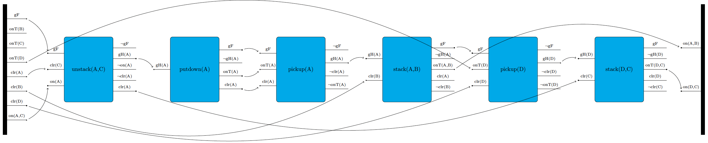

<!-- to compile:
pandoc aiplans-Introduction.md -o aiplans-Introduction.pdf \
  --pdf-engine=xelatex \
  -V geometry:"margin=2cm"
-->

# Instructions for Generating TikZ Diagrams Using LaTeX

You will need the following files:

- `tikzlibraryaiplans.code.tex` (library code)
- `main.tex` (the main document)
- `domain.tex` (for defining the action schemas)
- `plan.tex` (the plan that uses the defined actions) 


## Main LaTeX Document

Create a `main.tex` file that includes the domain file (such as `blocksworld_domain.tex`) and the specific plan file(s) (such as `blocksworld_plan.tex` in our example).

```latex
\documentclass[border=1in]{standalone}
\usepackage{tikz}
\usetikzlibrary{aiplans}
\begin{document}
\input{domain}  % Action schema specification
\input{plan}    % The plan to display
\end{document}
```

## Define Action Model -- aka the Domain

In this step, you will create a `domain.tex` file where you define your action model, not unlike in HDDL. I.e., you provide action schemata (that take parameters) that you can later use with different instantiations of those parameters (you will later see an example).

Each action schema you define follows a specific pattern:

<div style="page-break-after: always;"></div>

```latex
NameOfScheme /. style n args = {num of input parameters}
    {action= 
      % number of precs/effs
      {num of precondition lines (on the left side of action)}
      {num of effect lines (on the right side of action)}
      % the actual prec/eff to display
      {sequence of precondition labels}
      {sequence of effect labels}
      % length of precs/effs
      {length of preconditions}
      {length of effects}
      % action name to display
      {action name}
      % prec/eff label position
      {precondition/effect label position: above lines or on their side}
      {height of node}
    }
```

That is, for each action schema you provide one such definition that you can later reference in your plan with different arguments/parameters. In a Blocksworld example, you may define an action schema `stack()` with two arguments (i.e., two block constants) and then in the plan use that schema multiple times with different constants. 

Note that often several actions might share several attributes such as precondition of effect length. Hence, in our example, we factored out those properties as follows:

```latex
\tikzset{
    STYLE/.style n args = {5}{
        action={#1}{#2}{#3}{#4}{1}{1.4}{#5}{0}{6 cm}
    }
}
```

Note that here you could also specify any arguments that you want to apply to all actions, such as different widths, or fill coloring. For example, by simply appending `minimum width=2cm` to change our default width.

Then, when defining our action schema, each action uses this pre-defined style so that we have to define shared properties only once. In our example, all precondition lengths are 1cm and all effects have length 14 cm. Also, all preconditions/effects occur on the left/right of all actions (rather than above/below) and, finally, all actions have a height of 6 cm. Based on this factored out `STYLE`, we define our actions as follows:

```latex
\tikzset{
 PICKUP/.style n args  = {1}{STYLE={3}{4}{gF,onT(#1),clr(#1)}
                                         {$\neg$gF,gH(#1),$\neg$clr(#1),$\neg$onT(#1)}
                                         {pickup(#1)}},
 PUTDOWN/.style n args = {1}{STYLE={1}{4}{gH(#1)} # of precs/effs; then precs
                                         {gF,$\neg$gH(#1),onT(#1),clr(#1)}
                                         {putdown(#1)}},
 STACK/.style n args   = {2}{STYLE={2}{5}{gH(#1),clr(#2)} # of precs/effs; then precs
                                         {gF,$\neg$gH(#1),onT{(#1,#2)},clr(#1),$\neg$clr(#2)}
                                         {stack{(#1,#2)}}},
 UNSTACK/.style n args = {2}{STYLE={3}{5}{gF,clr(#2),on(#1)}
                                         {$\neg$gF,gH{(#1)},$\neg$on(#1),$\neg$clr(#1),clr(#1)}
                                         {unstack{(#1,#2)}}}
}
```

In the example above, the preconditions and effects have the following meaning:
- gH: gripper holds the respective object
- gF: the gripper is free, hence doesn't hold any object
- clr: the respective block is clear, i.e., no other block is above it
- onT: the respective block sits directly on the table
- on: one block (first argument) sits on the other block (second argument)

Note that you can also set action schema-specific properties, just like we have done above (with the minimum width) for *all* action schemata. You do this simply by adding the respective property to the respective action schema definition. Just make sure to add it after loading the action macro. For example, to fill all pickup actions in red, specify provide the following definition:

```latex
PICKUP/.style n args = {1}{STYLE={3}{4}{gF,onT(#1),clr(#1)}
                                       {$\neg$gF,gH(#1),$\neg$clr(#1),$\neg$onT(#1)}
                                       {pickup(#1)},fill=red},
```

Finally, note that we provide a pre-defined way to define the initial state and goal description. 

```latex
INIT/.style={
  init={
    {number of effects},
    {effects},
    {effects length},
    {height of init}}}
GOAL/.style={
  goal={
    {number of preconditions},
    {preconditions},
    {preconditions length},
    {height of goal}}}
```

In our Blocksworld example, it would look as follows:

```latex
\tikzset{
 INIT/.style = {init={8}{gF,onT(B),onT(C),onT(D),clr(A),clr(B),clr(D),{on(A,C)}}{1.2}{8 cm}}, 
 GOAL/.style = {goal={2}{{on(A,B)},{on(D,C)}}{1.2}{8 cm}}
}
```


## Specify your Plan 

A plan is a simple tikzgraphic, with the difference that we now offer two special labels:
- nodes can use the predefined schemata (to be instantiated as seen in the example)
- draw commands feature a causal link command, which draw dots on the two anchors of the respective link

```latex
\begin{tikzpicture}
    \node[INIT]           (init) {};
    \node[UNSTACK={A}{C}] (unstackAC) [right=3.5cm of init]      {};
    \node[PUTDOWN={A}]    (putdownA)  [right=3.5cm of unstackAC] {};
    \node[PICKUP={A}]     (pickupA)   [right=3.5cm of putdownA]  {};
    \node[STACK={A}{B}]   (stackAB)   [right=3.5cm of pickupA]   {};
    \node[PICKUP={D}]     (pickupD)   [right=3.5cm of stackAB]   {};
    \node[STACK={D}{C}]   (stackDC)   [right=3.5cm of pickupD]   {};
    \node[GOAL]           (goal)      [right=3.5cm of stackDC]   {};

    \draw [causalLink, bend left]     (init-eff-1)      to (unstackAC-pre-1);
    \draw [causalLink, bend left]     (init-eff-5)      to (unstackAC-pre-2);
    \draw [causalLink, bend right]    (init-eff-8)      to (unstackAC-pre-3);
    \draw [causalLink, bend left]     (unstackAC-eff-2) to (putdownA-pre-1);
    \draw [causalLink, bend left]     (putdownA-eff-1)  to (pickupA-pre-1);
    \draw [causalLink, bend right]    (putdownA-eff-3)  to (pickupA-pre-2);
    \draw [causalLink, bend right]    (putdownA-eff-4)  to (pickupA-pre-3);
    \draw [causalLink, bend left]     (pickupA-eff-2)   to (stackAB-pre-1);
    \draw [causalLink, bend right]    (init-eff-6)      to (stackAB-pre-2);
    \draw [causalLink, bend left]     (stackAB-eff-1)   to (pickupD-pre-1);
    \draw [causalLink, bend left]     (init-eff-4)      to (pickupD-pre-2);
    \draw [causalLink, bend right=20] (init-eff-7)      to (pickupD-pre-3);
    \draw [causalLink, bend left]     (pickupD-eff-2)   to (stackDC-pre-1);
    \draw [causalLink, bend right=20] (unstackAC-eff-5) to (stackDC-pre-2);
    \draw [causalLink, bend left]     (stackAB-eff-3)   to (goal-pre-1);
    \draw [causalLink, bend left]     (stackDC-eff-3)   to (goal-pre-2);
\end{tikzpicture}
```

You can see, among others, that the `stack` schema is drawn twice, once with arguments `A` and `B` and once with arguments `D` and `C`. Also, just like you were able to specify action schema-specific properties, you can also do that per search node. For example, although above both `stack` nodes would show all the same properties, you could, for example, define the following:

```latex
    \node[STACK={D}{C},fill=red]   (stackDC)   [right=3.5cm of pickupD]   {};
```

which would only fill that specific stack action in red, but not any others.

The plan is then depicted as follows:



We also provide our example directly in compilable code.